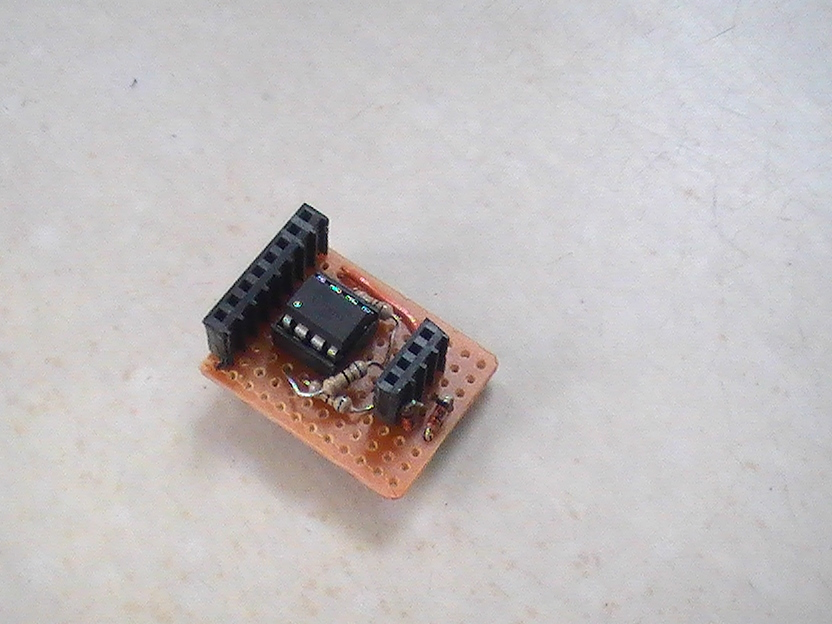
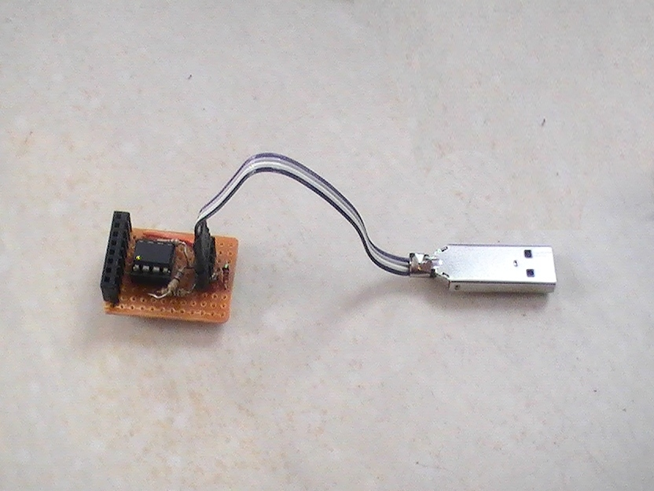
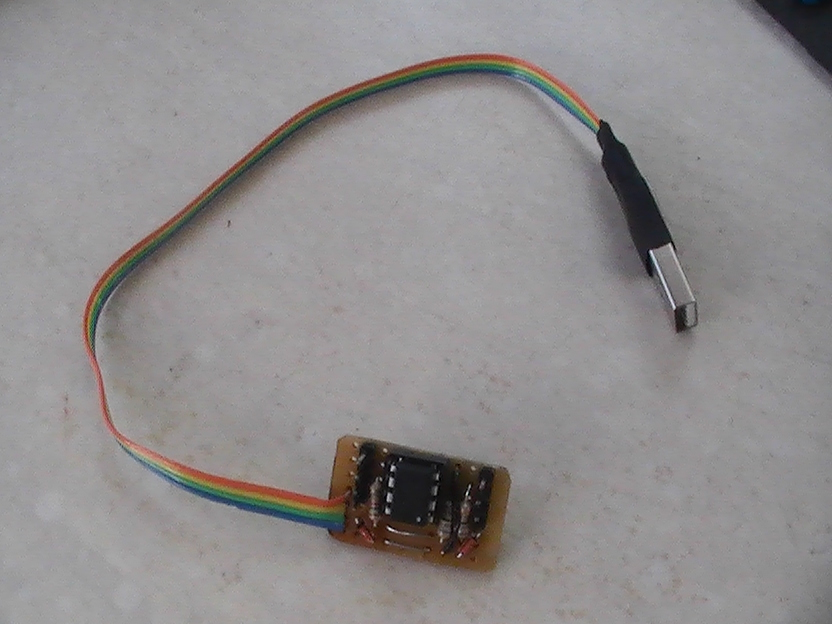
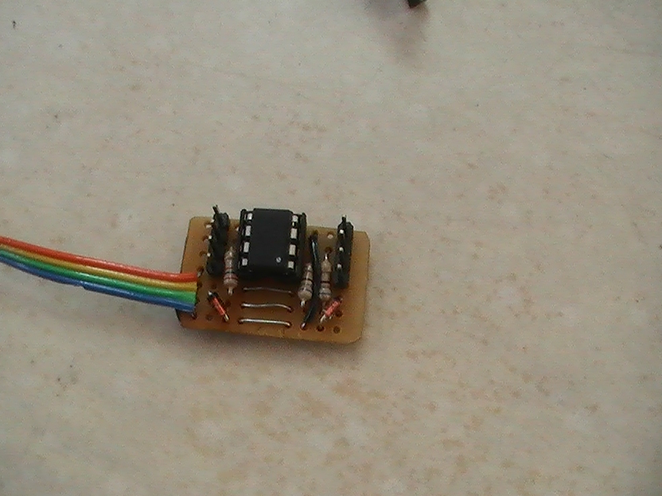
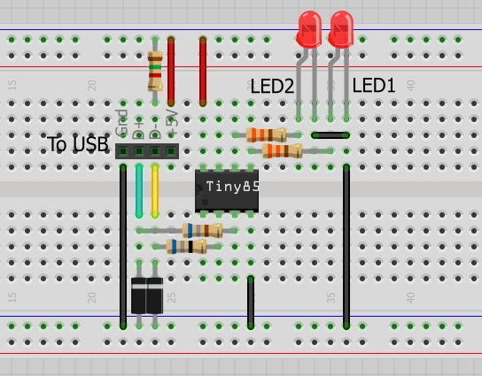

Quiz
====

Una versión diminuta de arduino.

Version 0.1
-----------

Versión 0.2
-----------

* La versión es más compacta y tiene el USB unido a la plaqueta

Firmware
--------

El que usamos actualmente es la **versión 1.0.6** `micronucleus/firmware/releases/micronucleus-1.06.hex`

Circuito para conectar por USB
------------------------------
 

> Este dibujo no es difinitivo

* Diodo 1N4148 
* 2 Diodos zener 3V6
* Resistencia 1k5 - 1500 Ohms 1/4W 
* 2 Resistencia 68 Ohm 1/4W
* Capacitor Ceramico 100nF 
* Capacitor Electrolitico 10uF/16V 

Software
--------

~~~
sudo aptitude install libftdipp1 libftdi1
~~~

Para que la computadora lo detecte necesitamos instalar las reglas de [Digispak](http://sourceforge.net/projects/digistump/files/) en [Arduino](http://arduino.cc/).

~~~
void setup() {               
  // inicia los pins
  pinMode(0, OUTPUT);	// LED1
  pinMode(1, OUTPUT);	// LED2
}
void loop() {
  // prende el LED1 y apaga el LED2
  digitalWrite(0, HIGH);
  digitalWrite(1, LOW);
  delay(1000);	//espera 1 segundo
  // apaga el LED1 y prende el LED2
  digitalWrite(0, LOW);
  digitalWrite(1, HIGH);
  delay(1000);	// espera 1 segundo
}
~~~

Este es uno de los ejemplos que vienen en la versión de arduino de Digispak

Pendientes
----------

* Explicar como [cargar el firmware](https://github.com/b4zz4/RaspberryPI#raspisp)
* Subir los circuitos
* Crear logo
